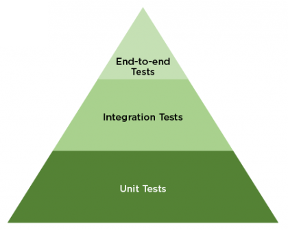

# Tests

This directory contains all tests for the `cleansumstats` pipeline. Tests
are divided into 3 levels according to the standard test pyramid:

- Unit tests
  - Individual `bash` functions (for large scripts)
  - Individual `bash` scripts (for small scripts)
- Integration tests
  - Individual `nextflow` processes
- End-to-end tests
  - Whole pipeline

